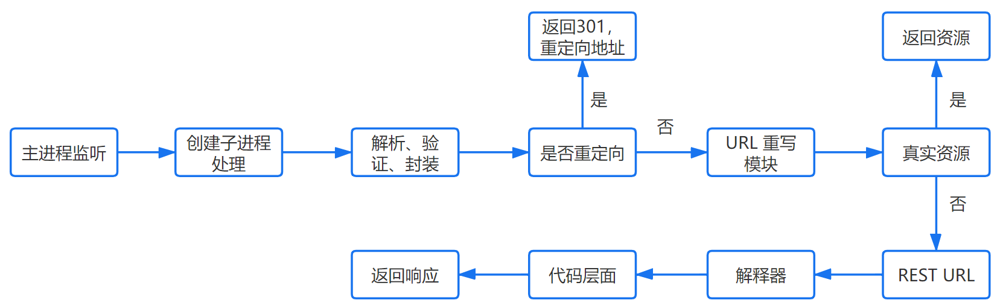

- 👋 Hi, I’m @renzhaoz
- 👀 I’m interested in life
- 🌱 I’m currently learning live
- 💞️ I’m looking to collaborate on how get more 
- 📫 youwillbeyou@163.com

# start

**一个纯碎的功利主义,谋而后动.** - 墨子

<font size=2>*(未来将会花费大量时间去不定时更新该文,便于入门和进阶coder了解web工作进程和原理,也欢迎各种斧子).*</font>

- 做什么
- 怎么做
- 如果做的更好  

不管做什么事,上面三点必是历程中最重要的一部分. 作为一个coder, 一切梦的开始从输入```http://www.1024.com```开始.  


## 地址解析
浏览器根据你输入内容分析是否是合法URL.帮助你补齐或者修复错误URL.  

## HSTS策略
浏览器处于安全考虑会强制使用HSTS强制客户端使用HTTPS协议访问url.即将```http://...```转化为```https://...```。
[详见HSTS](https://www.barretlee.com/blog/2015/10/22/hsts-intro/)

## 其它
浏览器还会进行一些其它的操作,比如安全检查,访问过滤,范文限制等等.例下:

1. 数据执行保护（DEP）
2. 地址空间分布随机化（ASLR）
3. 降低浏览器网页进程的权限

## 检查缓存
浏览器处于性能考虑提供了可以缓存资源文件的接口.但是设置了缓存的新鲜度(即缓存是会过期的).


>  知识点:
  a. 缓存可以用js读取操作吗？
  b. 可以手动强制缓存吗？
  c. 发起请求是可以拦截吗？

## DNS查询

1. 浏览器缓存
  浏览器首先检查是否在缓存中,没有则调用系统库函数进行查询.
2. 操作系统缓存
  操作系统也有自己的 DNS缓存，但在这之前，会向检查域名是否存在本地的 Hosts 文件里，没有则向 DNS 服务器发送查询请求。
3. 路由器缓存
  路由器也有自己的缓存。
4. ISP DNS缓存
  ISP DNS 就是在客户端电脑上设置的首选 DNS 服务器，它们在大多数情况下都会有缓存。

5. 如果以上步骤都没有拿到缓存则进行根域名服务器查询
在前面所有步骤没有缓存的情况下，本地 DNS 服务器会将请求转发到互联网上的根域.


>    知识点:
    a. 递归方式：一路查下去中间不返回，得到最终结果才返回信息（浏览器到本地 DNS 服务器的过程）
    b. 迭代方式，就是本地 DNS 服务器到根域名服务器查询的方式。
    c. 什么是 DNS 劫持?
    d. 前端 dns-prefetch 优化?

## TCP连接
TCP和IP分为4层,在发送数据时,每层都会对数据进行封装.下图是http简略通信过程:


- 应用层: 发送http请求

  在前面的步骤我们已经得到服务起的ip地址,浏览器会开始构建一个http报文,其中包括：
  1. 请求报头（Request Header）：请求方法、目标地址、遵循的协议等等
  2. 请求主体（其他参数）

  > 知识点:
  浏览器只能发送GET、PUT方法、而打开网页请求资源文件使用GET方法

- 传输层： TCP传输报文

  传输层会发起一条到达服务器的 TCP 连接，为了方便传输，会对数据进行分割（以报文段为单位），并标记编号，方便服务器接受时能够准确地还原报文信息。

  在建立连接前，会先进行 TCP 三次握手(四次? 详细过程不做描述,机制问题没必要讨论)。

  > 知识点:
      SYN泛洪攻击

- 网络层: IP协议查询MAC地址
  将数据段打包，并加入源及目标的 IP 地址，并且负责寻找传输路线。判断目标地址是否与当前地址处于同一网络中，是的话直接根据 Mac 地址发送，否则使用路由表查找下一跳地址，以及使用 ARP 协议查询它的 Mac 地址。

  >> 注意：在 OSI 参考模型中 ARP 协议位于链路层，但在 TCP/IP 中，它位于网络层。

- 链路层: 以太网协议
  - 以太网协议
    根据以太网协议将数据分为以 “帧” 为单位的数据包，每一帧分为两个部分：

      1. 标头：数据包的发送者、接受者、数据类型
      2. 数据：数据包具体内容
  - Mac 地址
    以太网规定了连入网络的所有设备都必须具备 “网卡” 接口，数据包都是从一块网卡传递到另一块网卡，网卡的地址就是 Mac 地址。每一个 Mac 地址都是独一无二的，具备了一对一的能力。
  
  - 广播 
    发送数据的方法很原始，直接把数据通过 ARP 协议，向本网络的所有机器发送，接收方根据标头信息与自身 Mac 地址比较，一致就接受，否则丢弃。

    >> 注意： 接受方回应是单播.

    > 知识点：
      ARP攻击
  
  - 服务器处理请求
    简略流程如下:
    

    - HTTPD
      最常见的 HTTPD 有 Linux 上常用的 Apache 和 Nginx，以及 Windows 上的 IIS。它会监听得到的请求，然后开启一个子进程去处理这个请求。

    - 处理请求
      接受 TCP 报文后，会对连接进行处理，对 HTTP 协议进行解析（请求方法、域名、路径等），并且进行一些验证：
        1. 验证是否配置虚拟主机
        2. 验证虚拟主机是否接受此方法
        3. 验证该用户可以使用该方法（根据 IP 地址、身份信息等）

    - 重定向
      假如服务器配置了 HTTP 重定向，就会返回一个 301 永久重定向响应，浏览器就会根据响应，重新发送 HTTP 请求（重新执行上面的过程）。

    - URL重写
      查看 URL 重写规则，如果请求的文件是真实存在的，比如图片、html、css、js 文件等，则会直接把这个文件返回。
      否则服务器会按照规则把请求重写到 一个 REST 风格的 URL 上。
      然后根据动态语言的脚本，来决定调用什么类型的动态文件解释器来处理这个请求或者报404错误。

      > 知识点
      a. 状态码
      b. 请求拦截

## 浏览器接受响应

  浏览器接收到来自服务器的响应资源后，会对资源进行分析。
  首先查看 Response header，根据不同状态码做不同的事（比如上面提到的重定向）。
  如果响应资源进行了压缩（比如 gzip），还需要进行解压。
  然后，对响应资源做缓存。
  接下来，根据响应资源里的MIME类型去解析响应内容（比如 HTML、Image 各有不同的解析方式）。
  [MIME类型详见](https://developer.mozilla.org/zh-CN/docs/Web/HTTP/Basics_of_HTTP/MIME_types)


## 小结

其实从URL解析->浏览器接受响应为止, 其中的大部分内容作为一个纯前端coder基本没必要深入了解.知道大概个过程就可以(面试问握手细节？协议细节？yb).个人总结了下基本分为个部分(浏览器接受响应之后才是需要重点关注的部分).

- 客户端处理,即浏览器工作流程
  这一部分不同浏览器处理流程可能大相径庭,基本功能大同小异.缓存部分是重点.

- 网络通信
  有一种职业叫通信工程师.通信工程师根据通信的技术又分好多种(移动通信、光纤通信、微波通信、卫星通信、计算机通信等).
  如果简单了解下web通信过程,建议从HTTP协议开始学习.[详见HTTP入门](HTTP.pdf)

  >> 注意
  简单了解HTTP HTTPS HTTP2的区别,有助于排查某些网络问题(虽然这部分由后台配置,甩锅专用).
  TCP协议?
  IP协议?
  SSL/TLS协议？

## 浏览器渲染

- 简介

  客户端接收到响应就开始处理.处理的终端就是浏览器.浏览器由不同的公司开发,所以处理的流程都是不全相同的.
  但是绝大部分都会遵守web开发的一些协议和标准(没遵守的部分就是坑).如下:

    [W3C](https://www.w3.org/) 
    [HTML5](https://developer.mozilla.org/en-US/docs/Web/Guide/HTML/HTML5)
    [ECMAScript](https://baike.baidu.com/item/ECMAScript%206/22641264)
    [CSS3]

- 主流浏览器内核.(浏览器内核实现都很复杂,所以国内基本gg,也是大多数国内浏览器都是套壳的原因.内核实现的代码量与linux的实现代码量相当超1000wL.)
  Edge - Trident
  Chrome - Blink
  Safari - WebKit
  FireFox - Gecko

- 浏览器处理web资源的基本流程
  不同的内核实现的流程大致相同(不同的遇见就是坑).大概如下:
  

### HTML解析

  MIME若接受到的文件MIME类型为text/html(接受的文件是正常html后缀的文件).则按照文件内容规定的规范进行解析文件.若接受到的文件类型有错或者文件内容有错不一定会报错.浏览器提供了一定能力的容错机制.然后浏览器从上往下一行一行地解析HTML。

- 解码encoding
  传输回来的其实都是一些二进制字节数据，浏览器需要根据文件指定编码（例如 UTF-8）转换成字符串，也就是 HTML 代码。

- 预解析（pre-parsing）
  预解析做的事情是提前加载资源，减少处理时间，它会识别一些会请求资源的属性，比如 img 标签的 src 属性，并将这个请求加到请求队列中。

- 符号化（Tokenization）
  符号化是词法分析的过程，将输入解析成符号，HTML 符号包括，开始标签、结束标签、属性名和属性值。
  它通过一个状态机去识别符号的状态，比如遇到 <，> 状态都会产生变化。

- 构建树（tree construction）
  > 注意：符号化和构建树是并行操作的，也就是说只要解析到一个开始标签，就会创建一个 DOM 节点。

- 事件
  当整个解析的过程完成以后，浏览器会通过DOMContentLoaded事件来通知DOM解析完成。在整个渲染过程中DOMContentLoaded事件只是浏览器整个生命周期事件中的一个.详见`浏览器生命周期`

  > 知识点
  DOCTYPE声明、charset文件编码格式、浏览器生命周期

### CSS解析

当解析HTML的过程中遇见了link标签,且路径对应css文件则进行下载该css文件.CSS文件是对HTML内容的一种装饰脚本.css的解析也是从上到下一行一行解析的.

- CSS匹配规则
  css下载完成后Css解析器开始立即解析(普通场景下),解析规范参考`CSS3`,然后我们会得到一个规则表.
  css的匹配算法是从右到左开始匹配的,这也是为什么尽量不让css有多个层级的原因.

> 知识点
  重汇 回流 权重 兼容性

### 渲染树

  生成的DOM树和CSS规则树融合的过程. 为了避免界面闪烁大部分情况下都是在解析DOM树之前就引入css(即在head标签中引入css).
  > 注意：渲染树会忽略那些不需要渲染的节点，比如设置了 display:none 的节点。

- 计算
  通过计算让任何尺寸值都减少到三个可能之一：auto、百分比、px，比如把 rem 转化为 px。

- 级联
  浏览器需要一种方法来确定哪些样式才真正需要应用到对应元素或者生效，所以它使用一个叫做 specificity 的公式，这个公式会通过权重取得.最终生效的生效的样式由权重最大的生效.
  [详见css权重]()

- 渲染阻塞
  当遇到`script`标签时,DOM构建会被暂停,直至脚本运行完毕然后继续构建DOM树.如果js依赖css样式.而css还未被下载和解析时,脚本的运行会被延迟,直到css构建完成.所以有以下规则:
  - CSS阻塞JS执行.
  - JS阻塞DOM解析.

  为了让页面尽快渲染完成,大部分摆放顺序都遵守以下规范:

  - CSS 资源排在 JavaScript 资源前面
  - JS 放在 HTML 最底部，也就是 </body> 前

  > 知识点:
  改变HTML解析顺序之defer,async

- 布局与绘制
  确定渲染树种所有节点的几何属性，比如：位置、大小等等，最后输入一个盒子模型，它能精准地捕获到每个元素在屏幕内的准确位置与大小。
  然后遍历渲染树，调用渲染器的 paint () 方法在屏幕上显示其内容。

  > 知识点:
  盒模型、怪异盒模型、定位、文档流、flex、样式融合等.

- 合并渲染层

  把以上绘制的所有内容合并，最终输出一张试图。
  > 注意：
  浏览器的窗口不是单纯的一维视图,而是三维.

<!-- - 回流与重汇

  - 回流
    当浏览器发现某个部分发现变化影响了布局时，需要倒回去重新渲染，会从 html 标签开始递归往下，重新计算位置和大小。
    reflow 基本是无法避免的，因为当你滑动一下鼠标、resize 窗口，页面就会产生变化。
  
  - 重汇
    改变了某个元素的背景色、文字颜色等等不会影响周围元素的位置变化时，就会发生重绘。
    每次重绘后，浏览器还需要合并渲染层并输出到屏幕上。
    回流的成本要比重绘高很多，所以我们应该尽量避免产生回流。
  
  > display:none 会触发回流，而 visibility:hidden 只会触发重绘。 -->

### JavaScript编译执行

  Js的编译和执行是web开发中比较复杂的一部分,也是最重要的一部分(越来越接近某些汇编语言的实现规则和逻辑,替代越来越多的后台语言的功能模块).大致流程如下：

  

- 词法分析
  JS 脚本加载完毕后，会首先进入语法分析阶段，它首先会分析代码块的语法是否正确，不正确则抛出 “语法错误”，停止执行。
  - 分词，例如将 var a = 2，，分成 var、a、=、2 这样的词法单元。
  - 解析，将词法单元转换成抽象语法树（AST）。
  - 代码生成，将抽象语法树转换成机器指令。

  > 知识点:
  LTR? 作用域

- 预编译
  JS 有三种运行环境：
  1. 全局环境
  2. 函数环境
  3. eval

  每进入一个不同的运行环境都会创建一个对应的执行上下文，根据不同的上下文环境，形成一个函数调用栈，栈底永远是全局执行上下文，栈顶则永远是当前执行上下文。

  - 创建执行上下文
    创建执行上下文的过程中，主要做了以下三件事：
    1. 创建变量对象 参数、函数、变量
    2. 建立作用域链 确认当前执行环境是否能访问变量
    3. 确定 This 指向

- 执行
  任何脚本的执行都存在线程和进程两个关键.[详见线程和进程](https://www.ruanyifeng.com/blog/2013/04/processes_and_threads.html)
  javascript是一个单线程脚本(如何开启第二线程？).

  

  虽然JS是单线程的,但是实际上参与工作的线程一共有四个如上所示.其中三个是协助只有JS引擎是真正执行的.
  - JS 引擎线程：也叫 JS 内核，负责解析执行 JS 脚本程序的主线程，例如 V8 引擎
  - 事件触发线程：属于浏览器内核线程，主要用于控制事件，例如鼠标、键盘等，当事件被触发时，就会把事件的处理函数推进事件队列，等待 JS 引擎线程执行
  - 定时器触发线程：主要控制 setInterval 和 setTimeout，用来计时，计时完毕后，则把定时器的处理函数推进事件队列中，等待 JS 引擎线程。
  - HTTP 异步请求线程：通过 XMLHttpRequest 连接后，通过浏览器新开的一个线程，监控 readyState 状态变更时，如果设置了该状态的回调函数，则将该状态的处理函数推进事件队列中，等待 JS 引擎线程执行。

  > 注意：
  浏览器对同一域名的并发连接数是有限的，通常为 6 个。

  > 知识点：
  微任务
    同步任务：按照顺序执行，只有前一个任务完成后，才能执行后一个任务
    异步任务：不直接执行，只有满足触发条件时，相关的线程将该异步任务推进任务队列中，等待 JS 引擎主线程上的任务执行完毕时才开始执行，例如异步 Ajax、DOM 事件，setTimeout 等。
  宏任务
    微任务是 ES6 和 Node 环境下的，主要 API 有：Promise，process.nextTick。
    微任务的执行在宏任务的同步任务之后，在异步任务之前。

## 参考文档


